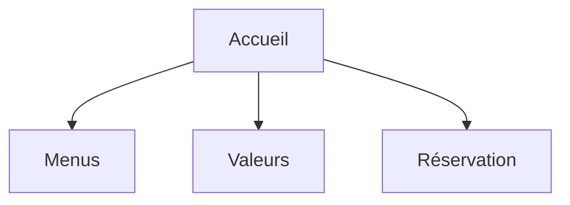

# Projet 1 : Site Web Restaurant "Grosso Modo"

## Team
Number of participants : 5
- Lana
- Yohann
- Malik 
- Julien
- Mathieu 

## Pitch

We were contacted by the Grosso Modo restaurant to build the website in HTML and CSS. 

## Site structuring

Work also on a common header and footer

### The site
- 4/5 pages
- Wireframes (to be validated with the customer before coding)
- Clean and validated code
- Use free/libre resources

### GitHub repository
- Code available on GitHub
- Deployed using [GitHub pages](https://pages.github.com/)
- Explicit commit messages

### Demos
- 10 minutes per team (presentation + demo + questions)
- Each friday

