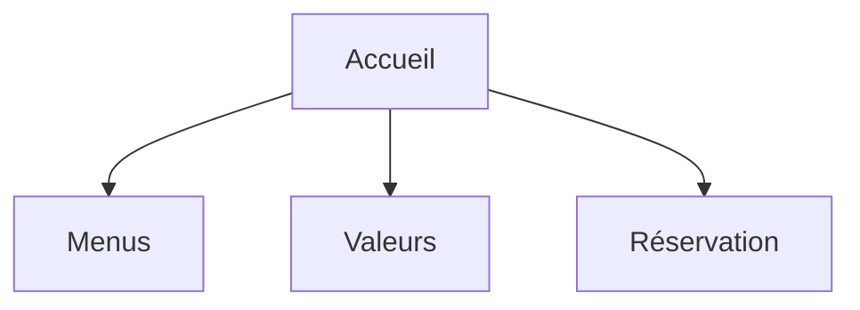
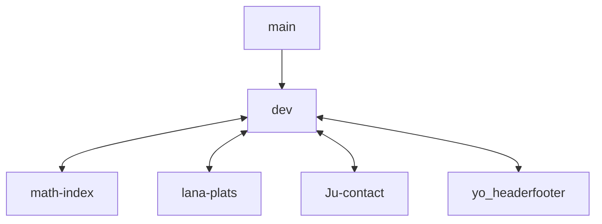

# Projet 1 : Site Web Restaurant "Grosso Modo"

## Team
Number of participants : 5
- Lana
- Yohann
- Malik 
- Julien
- Mathieu 

## Pitch

We were contacted by the Grosso Modo restaurant to build the website in HTML and CSS. We have a deadline of October 7, 2022.

## Site structuring

Work also on a common header and footer.

### The site

- 4 pages : 
  - index.html
  - nos-menus.html
  - nos-valeurs.html
  - reservation.html
  
We validated the first wireframes in 3 steps (paper / Figma) with the client. 

The format of the site will be necessary for mobile screens (480px) and desktop screens (1024px)

### GitHub repository

Nous avons créé un dossier sur GitHub dont la structuration est comme ceci : 

### Presentation

The site will be presented in an intermediate validation on September 30 and for the final validation on October 7.
